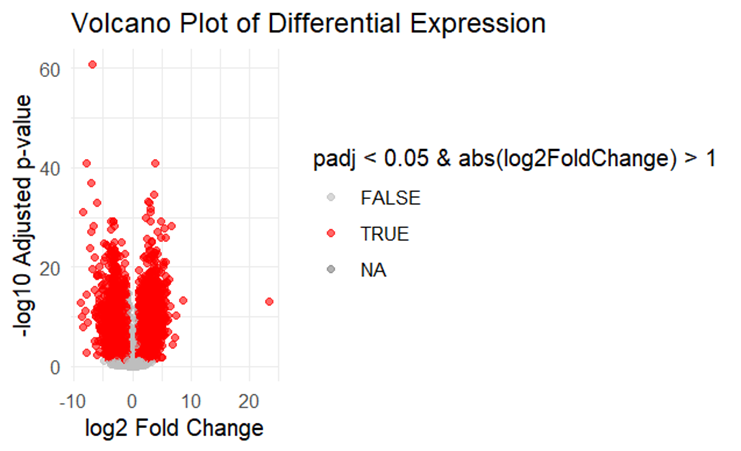

 **TCGA-BRCA Data Analysis Report**

Contributor: Madubuike Amaka / <amakamadubuike2023@gmail.com> / SlackID @ Ace\_well

 

 

**INTRODUCTION**

Breast cancer remains a significant global health concern, with complex molecular mechanisms underlying its development and progression. This study leverages the rich genomic data from The Cancer Genome Atlas Breast Cancer (TCGA-BRCA) project to identify potential biomarkers and gain insights into the molecular pathways involved in breast cancer.

 

**METHODOLOGY**

**Data Acquisition and Preprocessing**

We utilized the TCGAbiolinks R package (Colaprico et al., 2016) to download RNA-seq data from the TCGA-BRCA project. The dataset was preprocessed using the DESeq2 package (Love et al., 2014) for normalization and to account for batch effects.

 

**Differential Expression Analysis**

Differential expression analysis was performed using DESeq2, comparing primary tumor samples to solid tissue normal samples. Genes with an adjusted p-value < 0.05 and absolute log2 fold change > 1 were considered significantly differentially expressed.

Fig 1: Volcano plot

 

**Functional Enrichment Analysis**

To understand the biological context of the differentially expressed genes, we performed both Gene Ontology (GO) and Kyoto Encyclopedia of Genes and Genomes (KEGG) pathway enrichment analyses using the clusterProfiler package (Yu et al., 2012). This approach helps identify overrepresented biological processes and pathways in our gene set.

 

**Machine Learning Classification**

We implemented a Random Forest classifier using the randomForest R package (Liaw and Wiener, 2002) to distinguish between primary and solid tissue normal samples based on gene expression profiles. The model's performance was evaluated using accuracy metrics, ROC curve analysis, and feature importance ranking.

 

**Results and Discussion**

The differential expression analysis identified 20 significantly differentially expressed genes between primary tumor and solid tissue normal breast cancer samples.

 

Functional enrichment analysis revealed several significantly enriched GO terms and KEGG pathways. Notable GO biological processes include, neuroactive ligand-receptor interaction, PI3K Akt signaling pathway and cell cycle, suggesting the involvement of these processes in breast cancer progression. Key KEGG pathways enriched in our gene set highlight potential therapeutic targets.

 

-

Fig 2: ROC curve analysis for the TCGA-BRCA dataset.

Our Random Forest classifier achieved an accuracy of 0.92 to 2 d.p in distinguishing between primary tumour and solid tissue normal breast cancer samples. The ROC curve analysis yielded an AUC of 0.92, indicating good model performance.

 

 

Fig 3: Feature importance plot.

The top features (genes) contributing to the classification, as determined by the Random Forest importance measure are visualized in the plot. These genes may serve as potential biomarkers for distinguishing primary from solid tissue normal breast cancer.

 

 

 

Fig 4: Confusion matrix for the TCGA-BRCA.

 

 

 

**Conclusion**

This analysis of TCGA-BRCA data has provided insights into the molecular differences between primary and solid tissue normal breast cancer samples. The identified differentially expressed genes and enriched pathways offer potential avenues for further investigation into breast cancer progression mechanisms. The machine learning model demonstrates the feasibility of using gene expression profiles for sample classification, which could have implications for prognosis and treatment decisions.

 

**References**

1\. Colaprico, A., et al. (2016). TCGAbiolinks: an R/Bioconductor package for integrative analysis of TCGA data. Nucleic Acids Research, 44(8), e71.

 

2\. Love, M.I., et al. (2014). Moderated estimation of fold change and dispersion for RNA-seq data with DESeq2. Genome Biology, 15(12), 550.

 

3\. Yu, G., et al. (2012). clusterProfiler: an R package for comparing biological themes among gene clusters. OMICS: A Journal of Integrative Biology, 16(5), 284-287.

 

4\. Liaw, A. and Wiener, M. (2002). Classification and Regression by randomForest. R News 2(3), 18--22.

 

 

 

 

 

 

 

 

 
